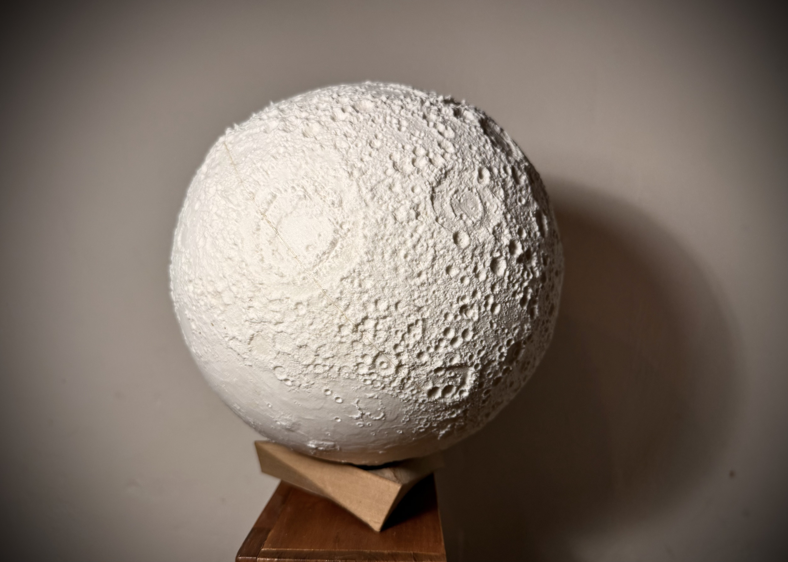

*Drafted in conversation with Claude.*

# The promise

I was inside the hype before most people had heard of it.

Not as a follower, as someone building the machines. The printers that were going to change everything. Print your food. Print your house. Print a new kidney. The future, extruded at 0.3mm per layer, delivered warm and slightly warped to your door.

The actual machines caught fire. They printed hot air, or piles of melting plastic that slumped off the bed. They were slow in a way that redefined slow, not minutes, not hours, days. And to make something that didn't look like a melted accident required a combination of patience, intuition and craft that nobody in the press releases was mentioning.

I knew that. I was building them.

# The territory

You never knew quite what you would get, sometimes the nozzle jammed after you left for the night and you came back to nothing, sometimes a stepper would fail and the head wouldn't move in an axis, producing piles of filament printed into scribble clouds around half-formed structures. The firmware for the board would crash on a bit of code every time, so you would measure the layers, figure out in the code where the print stopped, you'd position the head over the last bead, run the gcode from wherever you cut the file, like dropping the needle onto a spinning vinyl record halfway through a song.

It worked, saved a lot of my prints, but it's not how it's supposed to be, it's a magic spell cast in code and heat and motion. They did catch on fire too, we learnt to always have cameras on them, always with fire detectors and suppression and supervision. It worked, and when it worked it was extraordinary. We made a half-sphere of Mars, the size of a small dustbin lid, which has since been the scene of many a Lego space battle. Things that hadn't existed before and then did. That's what the hype was pointing at, even when the machines weren't ready for it yet.

# The moon

In 2015, Stephanie Lange and I made LUNA.

NASA had released depth map data of the lunar surface, precise elevation measurements, the whole globe, publicly available. We wrote Python scripts to project that data onto a sphere, converting the height information into a 3D model. Without the elevation boost we added, 15 times the real scale, the moon would be nearly indistinguishable from a smooth ball. Gravity is very good at flattening things. We made the mountains visible.

The slicer software we were using was alpha-grade. The BigRep ONE printer had a build volume of one cubic metre. Each half of the moon took two weeks to print. The whole piece took nearly a month. We ran it three times. One worked perfectly.

LUNA is 650mm across, about the size of a large school globe, I can't remember how many rolls of filament it took, but it was heavy, you can hold it and feel that weight, feel the craters. The Fabbaloo blog named it Design of the Week. It showed at 3D Printshow London, where visitors kept turning it over, looking for the side of the moon they recognised.

Someone took it home with them. Without asking.

I find this, as an artist, satisfying.

# The theft

There are many kinds of art theft, as I have learned listening to the fascinating *Tatort Kunst* podcast. Gold treasures melted down to their material value, a fraction of their cultural worth. Stolen art held as bargaining chips by professional criminals, forgery that's as fascinating, creative and talented as the original. This was none of those, I imagine; just someone taking something they found so desirable they had to have it.

I also like to think, it was in some part about the hype. Someone caught up in the cultural moment, drawn to the object by the buzz around it.

I have a smaller, higher-resolution version of the moon on my desk at home. I made it later, when the machines were better. It sits there and it is beautiful and it is mine, and no one has taken this one yet.

I treasure it, as both object and memory, and what it taught me as a craftsman.

*LUNA mini — a later print, higher resolution, still here.*

# After the hype

I know where 3D printing is now. Five times the speed. Five times the quality. Ten times the user experience. A fraction of the price. Machines that print overnight and don't require a prayer and a calibration ritual to produce something clean.

The hype promised this and then some, and when the printers caught fire and the press moved on, the industry looked like a failure. It wasn't. It was a filter.

The hype cycle creates a kind of pressure that sorts the people in a field by what they actually want. When the promise outstrips the reality, like when the food printers don't work and the house printers collapse and the kidney printers are still fifteen years away, most people leave. The ones who stay are the ones who were never there for the promise. They were there for the actual thing.

Gartner has a framework for this. Five stages: the Innovation Trigger, the Peak of Inflated Expectations, the Trough of Disillusionment, the Slope of Enlightenment, the Plateau of Productivity. They placed 3D printing at peak around 2012. It hit the trough by 2016. The framework is almost comically accurate in retrospect.

It's not unique to 3D printing. In 2001, Steve Jobs told Dean Kamen that his new invention, the Segway, would be bigger than the internet. John Doerr agreed. Kamen talked seriously about making cars obsolete and redesigning cities. The Segway became a tourism vehicle and stopped production in 2020. The gyroscope and balance technology inside it is now in every electric scooter on the pavement.

Virtual reality had a winter that lasted twenty years. The 1990s wave, VPL Research, Nintendo Virtual Boy, Jaron Lanier's promises, crashed around 1997. Industry veterans said you couldn't use the phrase "virtual reality" with investors and expect to be taken seriously. Then in 2012, Oculus launched a Kickstarter using mobile display technology that simply hadn't existed in the 90s. The people who stayed kept working on the problem until the hardware caught up with the idea.

Google Glass was Time Magazine's Best Invention of the Year in 2012. "Glasshole" entered the language by 2014. The consumer version was killed in January 2015. The enterprise version followed, and is now used in surgery, warehousing and manufacturing. The people who stayed took it somewhere the original hype never thought to look.

That's what happened. Not the future the hype described. Something more specific and, in its own way, more interesting: a technology that settled into what it was actually good at, improved by the people who stayed when everyone else had moved on to the next thing.

The houses are being printed now. ICON in Austin, Texas has built entire streets of them, structural shells completed in 24 to 72 hours, finished homes arriving 20 to 30 per cent cheaper than conventional construction. NASA is working with them on lunar habitat concepts. In medicine, 3D-printed titanium implants are now standard in orthopaedic surgery, custom-fitted to the patient before they go under. Surgeons print scale models of specific tumours and organs to plan complex procedures before making an incision. Even the food printer arrived, just not in any kitchen. Hospitals use it to produce precisely textured meals for patients who can't swallow normally; NASA uses it for space food. The kidney printer from the 2012 press releases hasn't come yet, but the research is accelerating. The hype had the right technology and the wrong timeline.

# What craft needs

What 3D printing taught me wasn't optimism or pessimism about technology. It was something more specific: you can only see inside a hype cycle clearly when you have the craft to read what's actually happening versus what's being promised. I was building the machines. I could feel the gap between the press releases and the print bed. The fires weren't a surprise. The month-long moon print wasn't a surprise either, it was what the technology actually was, once you got close enough to see it.

I think about this when I read about AI.

People ask me about AI, about the hype, and what I think it means. The honest answer is: I don't know. I'm not building the models. I don't have the equivalent of a month-long failed print to show me where the gap is between the promise and the terrain. I can see the hype. I can hear the promises, agents that will do everything, models that will think, systems that will replace entire categories of work. Some of it is probably true. Some of it is probably the food printer. I can't tell which is which from where I'm standing.

What I've learned is that scepticism without craft is just pessimism. And I don't have the craft here. But I can read the numbers.

OpenAI is targeting an IPO at over a trillion dollars while posting an annual operating loss of twenty-one billion. Anthropic is reportedly telling investors its total addressable market tops thirty trillion, larger than SpaceX's record estimate, larger than any TAM claim on record. For context, thirty trillion dollars is roughly a third of the entire global economy. And Dario Amodei, CEO of the same company making those projections, wrote something worth sitting with: *it is somewhat awkward to say this as the CEO of an AI company, but I think the next tier of risk is actually AI companies themselves.* A single company, he warned, might accidentally build something capable of threatening the systems that run modern life, decide unilaterally how to handle it, and loop everyone else in after the fact. The thirty-trillion-dollar opportunity and the existential risk disclosure came from the same person, in the same year. That is not a fringe concern from critics. That is the self-description of the people building it.

I understand the scepticism. A trillion-dollar valuation and an existential risk disclosure from the same industry, in the same breath, both claims are enormous, and judging either one fairly requires craft I just told you I don't have.

For now I will watch what the people who are actually building things do next, and wait.

I don't know where all this is going, if there's a crash coming, or if it's something larger than anything the hype is even claiming. What I do know is that it's out there now, and there's no going back. The people who stayed will keep working long after the hype moves on.

There's a Feist lyric I keep coming back to: *you can't unthink a thought, either it's there or not.*

# References

- **Kerry Stevenson,** "Design of the Week: LUNA," *Fabbaloo*, June 8, 2015. [fabbaloo.com/2015/06/design-of-the-week-luna](https://fabbaloo.com/2015/06/design-of-the-week-luna)

- **NASA Lunar Reconnaissance Orbiter / LOLA,** Lunar elevation data, 2010–. [pds-geosciences.wustl.edu/missions/lro/lola.htm](https://pds-geosciences.wustl.edu/missions/lro/lola.htm)

- ***Tatort Kunst*,** Deutschlandfunk. [podcasts.apple.com/de/podcast/tatort-kunst/id1704972975](https://podcasts.apple.com/de/podcast/tatort-kunst/id1704972975)

- **Gartner, "Hype Cycle for 3D Printing, 2019"** (as reported by *3Dnatives*). [3dnatives.com/en/gartner-hype-cycle-3dprintingpredictions-150120194](https://www.3dnatives.com/en/gartner-hype-cycle-3dprintingpredictions-150120194/)

- "Segway was supposed to change the world. Two decades later, it just might," *CNN Business*, October 30, 2018. [cnn.com/2018/10/30/tech/segway-history](https://cnn.com/2018/10/30/tech/segway-history)

- **IEEE Spectrum,** "The Segway Is Dead, but Its Technology and Vision Lives On." [spectrum.ieee.org/the-segway-is-dead-but-its-technology-and-vision-lives-on](https://spectrum.ieee.org/the-segway-is-dead-but-its-technology-and-vision-lives-on)

- **Wareable,** "Virtual reality: Then and now — why it won't fail this time." [wareable.com/vr/virtual-reality-then-now-why-it-wont-fail-this-time](https://wareable.com/vr/virtual-reality-then-now-why-it-wont-fail-this-time)

- **Forbes / YEC,** "The Technology Hype Lifecycle: Google Glass Edition," February 17, 2015. [forbes.com/sites/theyec/2015/02/17/the-technology-hype-lifecycle-google-glass-edition/](https://forbes.com/sites/theyec/2015/02/17/the-technology-hype-lifecycle-google-glass-edition/)

- **Built In,** "3D-Printed Houses: 12 Top Examples." [builtin.com/articles/3d-printed-house](https://builtin.com/articles/3d-printed-house)

- **Plastics Today,** "3D Printing Is Still Revolutionizing Medical Technology." [plasticstoday.com/medical/how-3d-printing-is-revolutionizing-medical-technology](https://plasticstoday.com/medical/how-3d-printing-is-revolutionizing-medical-technology)

- **News Medical,** "3D Printing in Healthcare: From Surgical Tools to Organ Transplant Breakthroughs." [news-medical.net/life-sciences/3D-Printing-in-Healthcare-From-Surgical-Tools-to-Organ-Transplant-Breakthroughs.aspx](https://news-medical.net/life-sciences/3D-Printing-in-Healthcare-From-Surgical-Tools-to-Organ-Transplant-Breakthroughs.aspx)

- **The Motley Fool,** "OpenAI Is Reportedly Targeting an IPO Debut Above $1 Trillion," August 27, 2026. [fool.com/investing/2026/08/27/openai-is-reportedly-targeting-an-ipo-debut-above/](https://fool.com/investing/2026/08/27/openai-is-reportedly-targeting-an-ipo-debut-above/)

- **Yahoo Finance / Tech,** "Anthropic's CEO just warned everyone that the next big AI risk to humanity is 'actually AI companies themselves'." [tech.yahoo.com/ai/claude/articles/anthropics-ceo-just-warned-everyone-051500340.html](https://tech.yahoo.com/ai/claude/articles/anthropics-ceo-just-warned-everyone-051500340.html)

- **Wall Street Journal,** "Anthropic Contemplates the Ultimate Total Addressable Market." [wsj.com/cio-journal/anthropic-contemplates-the-ultimate-total-addressable-market-4cc2deed](https://wsj.com/cio-journal/anthropic-contemplates-the-ultimate-total-addressable-market-4cc2deed)

- **Feist,** "Undiscovered First," *Metals*, 2011. [open.spotify.com/track/6vWqBKW7cGZ7PXhkEcfN8n](https://open.spotify.com/track/6vWqBKW7cGZ7PXhkEcfN8n)
