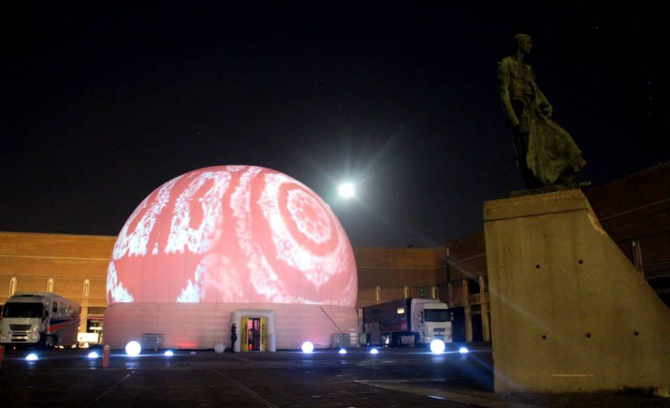

*Drafted in conversation with Claude.*

> *"I love deadlines. I love the whooshing noise they make as they go by."*
> Douglas Adams

There are deadlines and there are deadlines.

Most of them whoosh. A launch slips a week. A meeting reschedules. A delivery gets pushed. It's inconvenient, it's embarrassing, it gets quietly absorbed. We have a way of making excuses for ourselves. A deadline slips. A new deadline is set. That one slips too. At some point the deadline stops being a date and becomes a "target," and then a "goal," and then a "direction of travel." 

The people responsible for missing it attend a post-mortem that identifies lessons learned. The lessons are documented. Nobody applies them. This happens again, six months later, with the same people, on a different project.

That's not where I came from though, where I really learned my trade. I helped run parties and live events and for a while we were really good at it, even though nothing ever went exactly to plan. 

Live events have a different relationship with time and accountability. The party starts at eight. The crowd is already at the bar. If you get enough things wrong, it's not just the event that's over, it may be the last event you ever make.

That changes how you think.
# The dome

I'd been on a night train across Spain before I arrived in Vigo, the dome was already there, pumps blowing and slowly inflating against the backdrop of the late summer Spanish sky. We had 24 hours this time, more than usual, a lot had gone wrong on this tour so far but I'd been back home in Berlin for a week, solved the software issues, got the extra hardware we needed, that was laid out in front of me in the flight cases.

I spent the better part of an afternoon and most of the evening aligning projectors to the inside surface of an inflatable dome. Projection mapping is patient work. You're matching digital geometry to physical geometry, adjusting each projector's image so it falls exactly where it should, no overlap, no gap, no distortion at the joins. Mapping the surface with a series of measurements in the physical and digital world, modelling the dome inside our software, aligning the hardware so they matched. Do it right and the seams between projectors disappear. The surface becomes one screen. A 360-degree cinema.

This one was a good one. Big dome. Four projectors. I'd been at it for hours, I was exhausted really but that was ok, for the first time this project, I had it. The edge warping patch we'd added in the hackspace was working. Clean edges adapted to the imperfect surface with perfect alignment. 

I still see it in my mind's eye. I put on a 360 video — a surfer on a wave — and was there, in the water, immersed.

Blink.

The next thing I remember is a flashing white light, beating against the collapsed dome, flapping like a loose sail, rain pounding on my face. One of those moments where reality moves too fast for the brain. Something big had happened and I couldn't tell what.

The storm, it was worse than I thought, somehow it had tipped the dome over, got underneath it, blown it away. The dome was on its side, the projectors were scattered, still powered up and pouring out flickering, incoherent light, and I was standing in rain I hadn't dressed for, watching several hundred thousand pounds worth of equipment move in the wind in ways equipment is not designed to move.

Alone, while the rest of the crew slept. It was 2am, the party still started at 8pm, 18 hours to rescue things.

My brain kicked back in, don't panic, do something.

I hit the emergency stop on the generator, woke the rest of the crew and started triage. Irreplaceable things first, computers and hardware that were custom built, projectors and lenses that we had shipped from Germany to Spain. Down the list until every device and cable was unbuilt. 

Everything back to the hotel room, everything field stripped, all components out on the floor and photographed. I left the ground crew with hair dryers scrounged from every room in the hotel and instructions to dry every component and put it back exactly where it was, in this exploded diagram of damp technology. Then I needed to sleep, it was 6am already, I'd been awake for 24 hours and the party started in 14 hours.

Four hours later our tour manager shook me awake.

The ground crew had been working through the night, the dome was secure and reinflating as we spoke, that thing was never blowing away again. The hardware was all dry but I was the only one who knew how it went back together.

Computers back together and powered on, it reboots, the OS comes up, the software auto starts as we had programmed it. The mapping settings saved. The work still there. Projectors switched on, 3 of the 4 worked. Our tour manager is out the door, on the phone, he'll get me that 4th projector somehow, he says. "Get it built, I'll be there before the doors open".

We get it built, a notebook full of precise measurements, sketches for tower heights, angles, distances from the middle, and from each other. Ink smudged from the rain, didn't matter, was enough. Rebuilt it, turned it on, the last projector turns up, plugged in, powered on, the surfer's back on the wave. 

Guests were starting to arrive and no one who wasn't there would know.

*The same dome, a week later, back in Barcelona.*

# Eight o'clock

You cannot email the audience: we're running a bit behind, bear with us. You cannot push the show. The only variable you have is what happens in the time between now and when the doors open.

Live events have no last resort. The deadline is insoluble. Move it and there's no event, there's just an empty space with some wet cables in it and a reputation you no longer have.

# After enough events

This wasn't the first disaster I'd dealt with at a live event, it wasn't the last either, just a high point. I don't even know exactly when it stopped surprising me, but at some point disasters became just events.

Not because they stopped happening. Power cuts. Delayed headliners. Equipment that had worked perfectly at soundcheck and decided not to at the moment it mattered. The thing you were most confident about turning out to be the thing that needed the most attention.

It kept happening. And I stopped being surprised by it. And then, gradually, I stopped fearing it in the same way.

There is a version of this story where the dome falling over is just a disaster that happened once and then you move on.

But the deadlines kept coming, and so did the disasters, and what accumulated over time was a different kind of relationship with uncertainty. Not fatalism. Something more like literacy. You learn to read the situation faster because you've stopped looking for the escape route. You learn what you actually need versus what you wanted because the wanting gets expensive quickly when the clock is running.

*It may be your last* is a real thing in live events. I know this too because I still remember the real last event, the one we couldn't fix, that no one could. That's a whole other story though.

The party starts at eight. If it goes well then we'll see you, same time, same place, next week.

# References

- **Douglas Adams** on deadlines. *The Salmon of Doubt: Hitchhiking the Galaxy One Last Time*, ed. Peter Guzzardi, Heinemann, 2002.

- **Omnidome.** Cronin / Winkelmann, 2012–2026. [omnido.me](https://omnido.me/). 360° projection dome and mapping software, subject of this piece.

